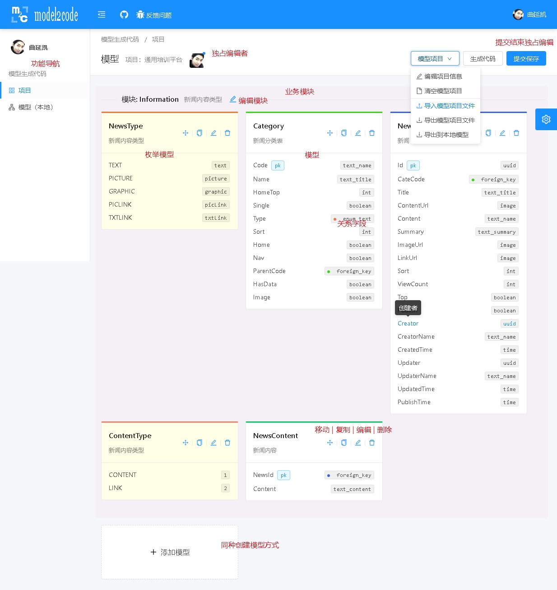
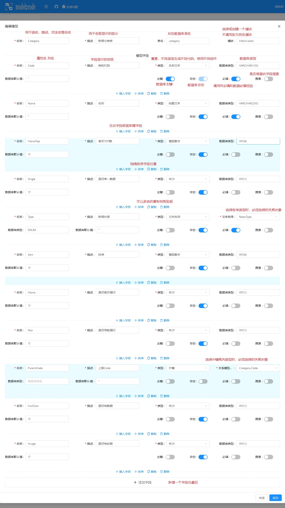
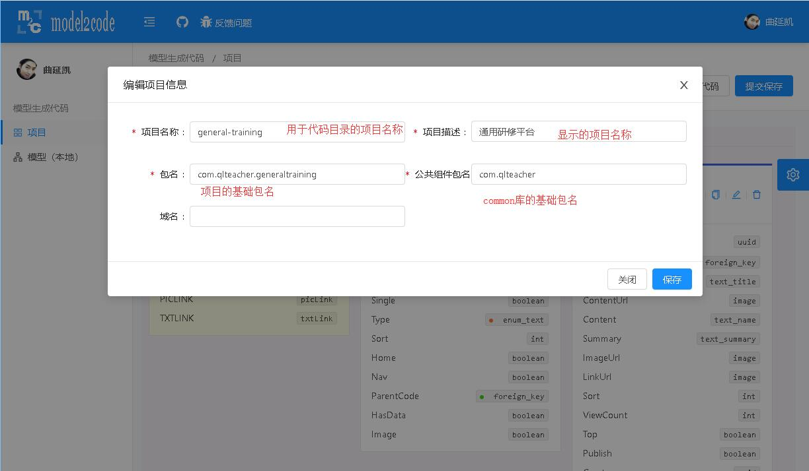
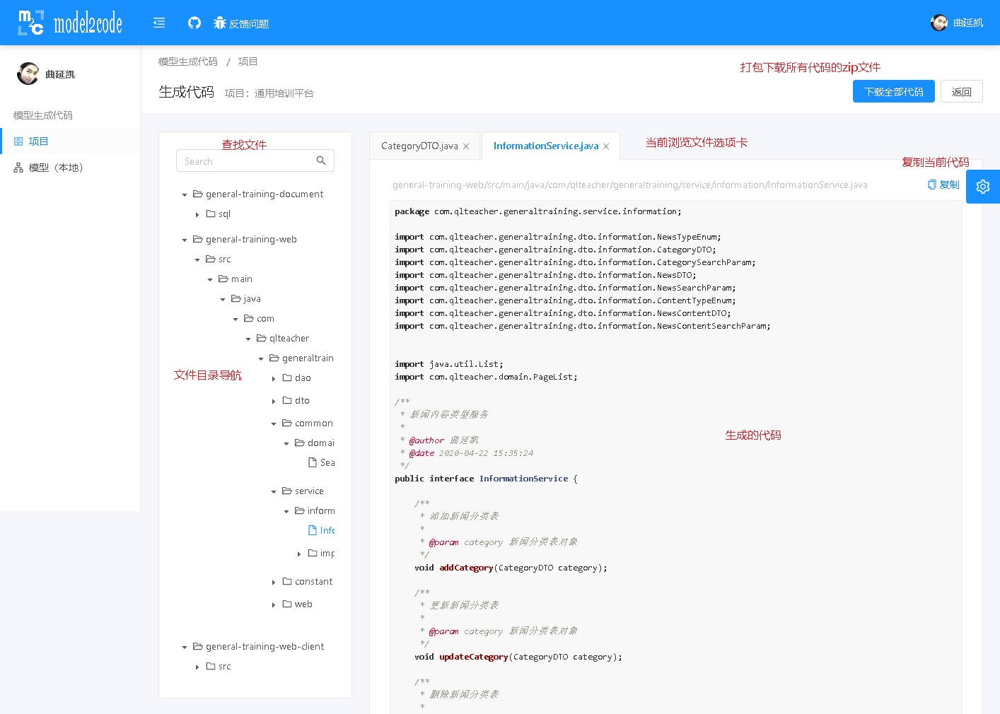

<p align="center">
  <a href="https://m2c.qltechdev.com/">
    
  </a>
  
</p>

<h1 align="center">model2code<br/>模型化全栈代码生成工具</h1>


<font size=5>
model2code 是一款为了提高前后端开发效率设计开发的，通过组织业务实体模型及其级联关系，生成为公司定制的前后端全栈参考代码的工具。

model2code 的作用仅限于相对固定的功能（实体主体的增删改查），不能完全代替开发人员的编码工作。饱和式生成的代码，很多代码是多余的，需要开发人员自己酌情删除不需要的内容。更为复杂的功能和逻辑需要开发人员自己编写了。

model2code 生成的代码可能无法直接运行，可能存在生成代码方法重名等问题，这些问题程序在没有提供更多配置设置的情况下无法解决和避免，需要开发人员自行修改生成代码。

当然遇见任何错误或异常，或者需要改进的需求，可以给作者提出[issues](https://git.qltechdev.com/quyankai/model2code/-/issues)。

</font>

## 使用

model2code 可以不登录使用（常用于仅前端部署的情况），但是模型项目文件只能通过导入导出文件，切换多个项目或交流给他人。用户登录以后可以进行多项目多人管理编辑模型。


多人多项目模型编辑需要获取独占编辑，完成编辑后提交保存，在此期间其他人无法修改项目模型，但是不妨碍查看模型，临时编辑模型（会被覆盖），生成代码，导出文件等操作。

编辑过程中意外关闭界面，可以显示上一次未提交的编辑内容（不清除浏览器缓存的情况下），请注意各项提示。

模型编辑区域呈现了各个模块和模型，每个模块或模型都有自己的颜色区分，鼠标指向关系字段可以显示相应关系的连接线。



编辑模型是个相对繁琐麻烦的过程，现在通过从数据库SQL语句生成，粘贴等方式可以相对简化这个过程。相应的一些约束可以通过提示告知，但是也有很多功能并不完善，需要用户摸索适应的过程。一旦熟悉了可以大量节省繁琐的代码编写过程。



每个项目需要通过编辑项目信息配置一些基础的参数。



随时可以生成代码查看效果，尽量编辑模型尽量完整全面，因为第一次可以成批的文件粘贴到您的项目中，一旦你开始着手修改代码，之后生成的代码只好局部复制粘贴了，要麻烦一些了。



## 生成代码规则

model2code 是符合当前公司开发代码习惯和规范的定制化代码生成工具。定制的代码生成规则可以随着公司开发习惯和规范的变动而修改。如果用户有新的代码生成规则需求，可以联系作者开发，或Fork[项目](https://git.qltechdev.com/quyankai/model2code)自行开发。

```text
src/app/routes/model/generator
│  generator-factory.ts     代码生成服务
│  generator.ts             代码生成器基类
│
└─impl
       database-generator.ts                    数据库表结构代码生成器
       database-permission-generator.ts         数据库插入权限语句生成器
       java-constant-base-role-generator.ts     后端基础角色常量生成器
       java-constant-cache-key-generator.ts     后端缓存常量生成器
       java-constant-permission-generator.ts    后端权限常量生成器
       java-dao-read-generator.ts               后端从库DAO生成器
       java-dao-write-generator.ts              后端主库DAO生成器
       java-dto-generator.ts                    后端DTO生成器
       java-dto-search-param-base-generator.ts  后端搜索参数基类生成器（项目集成）
       java-dto-search-param-generator.ts       后端搜索参数生成器
       java-enum-generator.ts                   后端枚举生成器
       java-service-generator.ts                后端服务接口生成器
       java-service-impl-generator.ts           后端服务实现生成器
       java-web-controller-generator.ts         后端WebControll生成器
       ng-app-data-json-generator.ts            前端导航配置生成器
       ng-component-edit-html-generator.ts      前端编辑页面html生成器
       ng-component-edit-ts-generator.ts        前端编辑页面ts生成器
       ng-component-list-html-generator.ts      前端列表页面html生成器
       ng-component-list-ts-generator.ts        前端列表页面ts生成器
       ng-component-set-m2m-html-generator.ts   前端设置多对多页面html生成器
       ng-component-set-m2m-ts-generator.ts     前端设置多对多页面ts生成器
       ng-constant-base-role-generator.ts       前端基础角色常量生成器
       ng-constant-permission-generator.ts      前端权限常量生成器
       ng-model-enum-ts-generator.ts            前端枚举生成器
       ng-model-search-param-ts-generator.ts    前端搜索参数实体生成器
       ng-model-ts-generator.ts                 前端实体生成器
       ng-module-ts-generator.ts                前端业务module生成器
       ng-routing-module-ts-generator.ts        前端业务路由生成器
       ng-service-ts-generator.ts               前端业务服务生成器
       ng-shared-json-schema-helper-ts-generator.ts 前端sf工具生成器（项目集成）
       ng-shared-model-ts-generator.ts          前端公共实体生成器（项目集成）
```

## 部署

model2code 是基于angular和ng-alain，主要功能由前端开发。可以只部署前端项目，但是无法使用多项目多人协同。部署服务器端可以实现完整功能。


## 链接

+ [model2code项目代码](https://git.qltechdev.com/quyankai/model2code)
+ [model2code-server项目代码](https://git.qltechdev.com/quyankai/model2code-server/)
+ [公司model2code](https://m2c.qltechdev.com/)

## 支撑

+ `ng-zorro-antd` based
+ `ng-alain` based
+ [@delon](https://github.com/ng-alain/delon)

## 赞助

如果使用本工具感觉好用，且希望物质感谢作者，请随意赞助。

 

